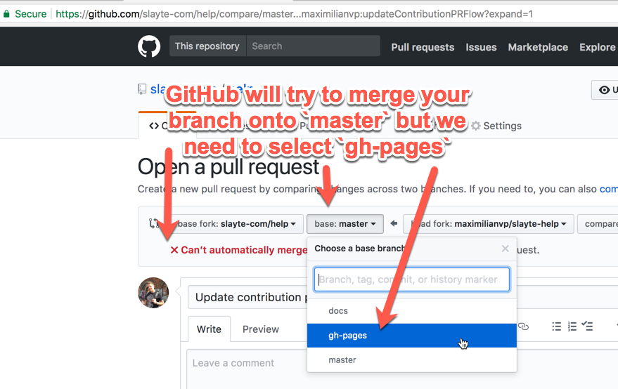
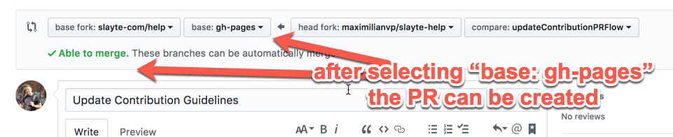
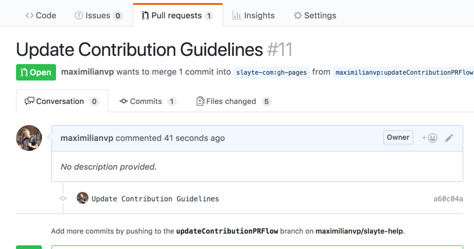
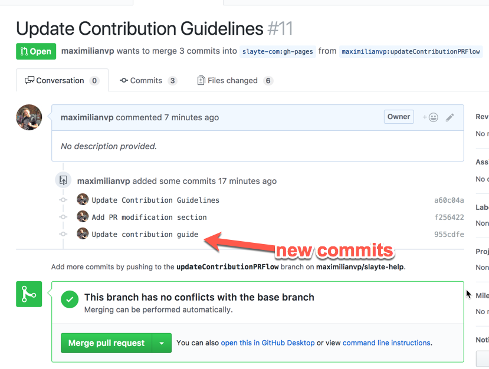

# Types of Articles

We will distinguish help articles into three categories:

### 1. Tutorial

Tutorial articles must focus on providing step-by-step instructions leading from motivation to goal, annotated with screenshots and videos where applicable.

### 2. Issues

Problems and their solutions should be described pointing out 1) Problem, 2) Environment, 3) Resolution, 4) Cause.

### 3. FAQ

An FAQ article should state a list of questions with an answer clearly attached to each question.


# Setting up your local copy

1. Ensure you're logged into GitHub with the account you want to contribute from.
2. First, fork the `gh-pages` branch of the help repository:

3. Check out your fork on your local computer using HTTPS, like so:
```
$ cd ~
$ git clone https://github.com/<GITHUB USERNAME>/help.git
$ cd help
$ git checkout gh-pages
$ git pull origin gh-pages
```
4. Add the upstream repository (to be able to update for pull requests):
```
$ git remote add upstream https://github.com/slayte-com/help.git
```
5. Install Jekyll (details: https://jekyllrb.com/docs/quickstart/)
```
$ sudo gem install jekyll bundler
```
6. Install the dependencies and run jekyll:
```
$ bundle install
```
7. Run jekyll:
```
$ bundle exec jekyll serve
```
This starts a watcher-service on your computer and runs a jekyll server that updates the generated website with every change you make to the documentation. By default the website's url is [http://127.0.0.1:4000](http://127.0.0.1:4000). Simply reload to view the updates.

We are using Github Flavored Markdown in Jekyll as the markup language. Read more here: [https://guides.github.com/features/mastering-markdown/](Mastering Markdown).

# Contribution Workflow

To contribute and send a Pull Request, we will follow the procude as outlined below.

## 1. Before making changes, update your local directory

Bring your local directory up-to-date with the upstream
```
$ git checkout gh-pages
$ git pull upstream gh-pages
```

Update your fork with the upstream changes
```
$ git push origin gh-pages
```

## 2. Create a new branch and start your edits

Create a new branch to commit your work to:
```
$ git checkout -b updateContributionPRWorkflow
```

**Now make your desired changes, e.g. create articles**

View the changes you are going to commit
```
$ git status
```

## 3. Commit and push

Add the files, or the entire folder to your commit
```
$ git add .
$ git commit -m "Update tutorial on Call Creation to include Reviewer Groups"
```

Push your local commits to your fork (*IMPORANT*: Same branch name as in step 2: e.g. `updateContributionPRWorkflow`)
```
$ git push origin updateContributionPRWorkflow
```

## 4. Create the Pull Request on github.com

Visit your GitHub fork and see your recently pushed branch (here: `updateContributionPRWorkflow`)


After clicking **Compare & pull request**, adjust the base-branch for GitHub to point to the `gh-pages` base-branch.



After **changing the base-branch** you can create the Pull Request.



The finished pull request can now be reviewed:




## 5. Updating a pull request

When changes are required to a pull request to e.g. fix a typo, follow the steps below:

Ensure your local directory has no changes in git, and that you're on the branch of the pull request (example: `updateContributionPRWorkflow`):

```
$ git status
On branch gh-pages
Your branch is up-to-date with 'upstream/gh-pages'.
nothing to commit, working directory clean

$ git checkout updateContributionPRFlow
Switched to branch 'updateContributionPRFlow'

```

**Make your changes.**

Confirm the changes are ready to be committed

```
$ git status
On branch updateContributionPRFlow
Changes not staged for commit:
  (use "git add <file>..." to update what will be committed)
  (use "git checkout -- <file>..." to discard changes in working directory)

    modified:   _contribution/guide.md

no changes added to commit (use "git add" and/or "git commit -a")
```

Add the changes and confirm they've been added

```
$ git add .
$ git status
On branch updateContributionPRFlow
Changes to be committed:
  (use "git reset HEAD <file>..." to unstage)

    modified:   _contribution/guide.md
```

Commit your changes

```
$ git commit -m "Update contribution guide"
[updateContributionPRFlow 522cd7a] Update contribution guide
 1 file changed, 14 insertions(+), 1 deletion(-)
```

Push your commit to your branch on your fork:

```
$ git push origin updateContributionPRFlow
```

And the PR will be automatically updated with the changes:




