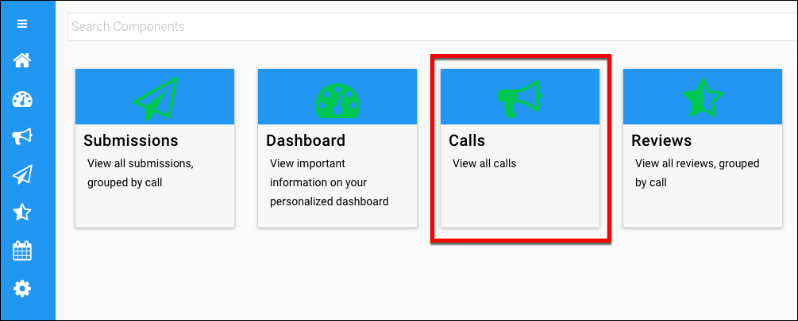
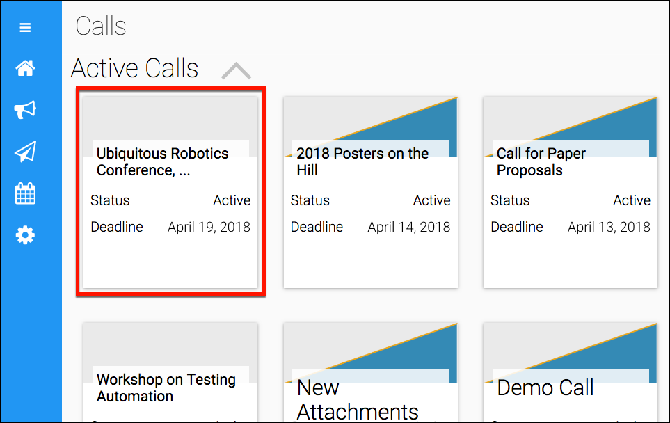
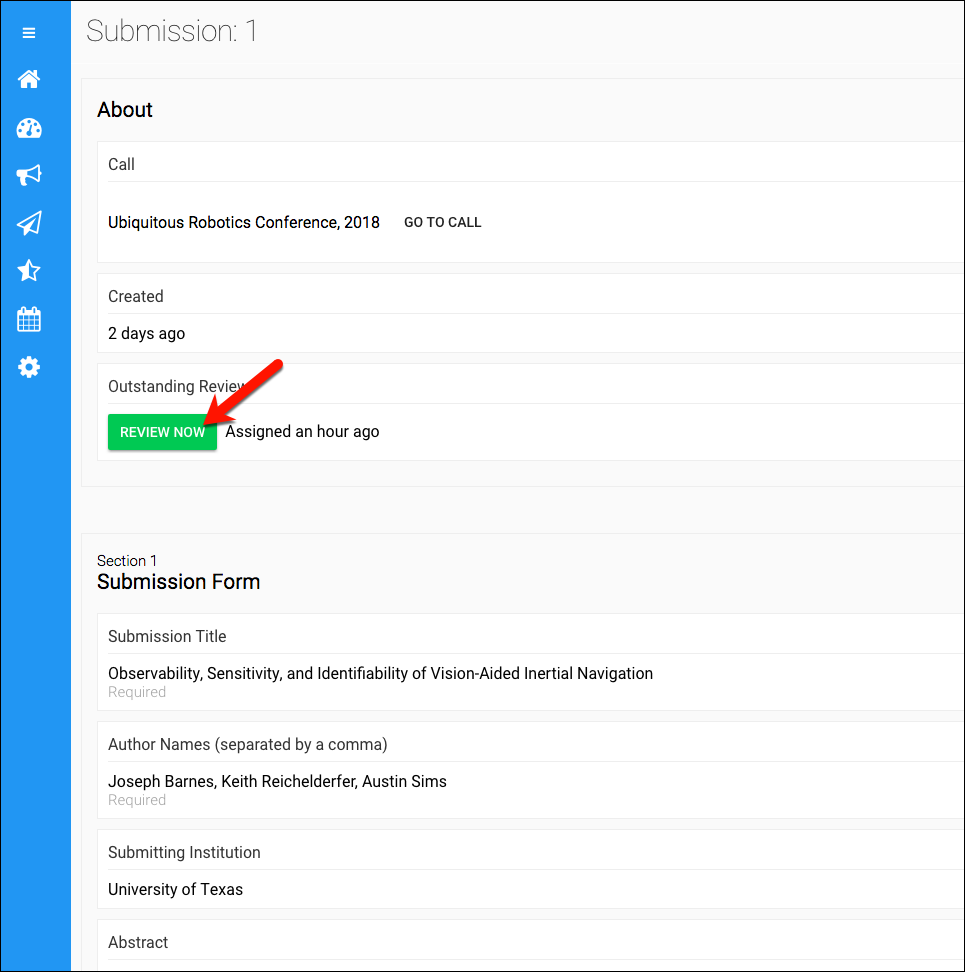
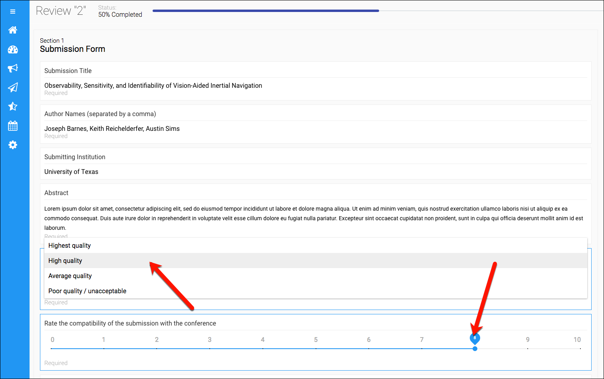
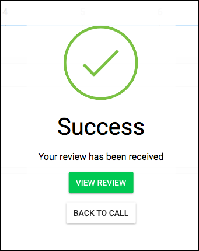

# Reviewing a Submission

In this article, you'll learn how to check for review assignments and complete a review for a submission.

An administrator assigns a submission to a reviewer, who will receive notice that a submission is ready for review. The reviewer logs into Slayte and navigates to the submisson, and completes a review form. The details for this workflow are given below.

## Check for review assignments

**Step 1** — Navigate to the Home page, then click the **Calls** button.

**Step 2** — Click the call containing a submission that you need to review.

**Step 3** — Look in the **Review** section to see if any reviews are waiting, and click on a submission if it's available. 

If no reviews have been are assigned, no action is necessary at this time.

##Perform the review

**Step 1** — Click on a submission in the **Review** section.

**Step 2** — In the Submission summary page, click on the **Review Now** button.

**Step 3** — Complete the review form.

**Step 4** — Scroll to the bottom and click the **Submit Review** button. In the confirmation popup, you may either examine the review or go back to the call.

