# Create a Submission to a Call

In this article, you'll learn how to choose a call, prepare a submission to that call, and sneding the submission.

## Choose a Call 

Step 1 — Navigate to the Home page, then click the **Calls** button.

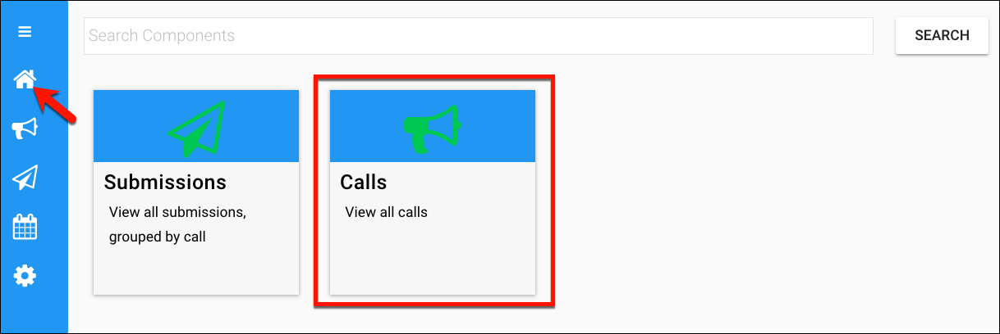

Click the call to which you want to make a submission.

Review the submission information, taking special note of the  **Status** and the **Deadline**. Then click the **Create Submission** button. 

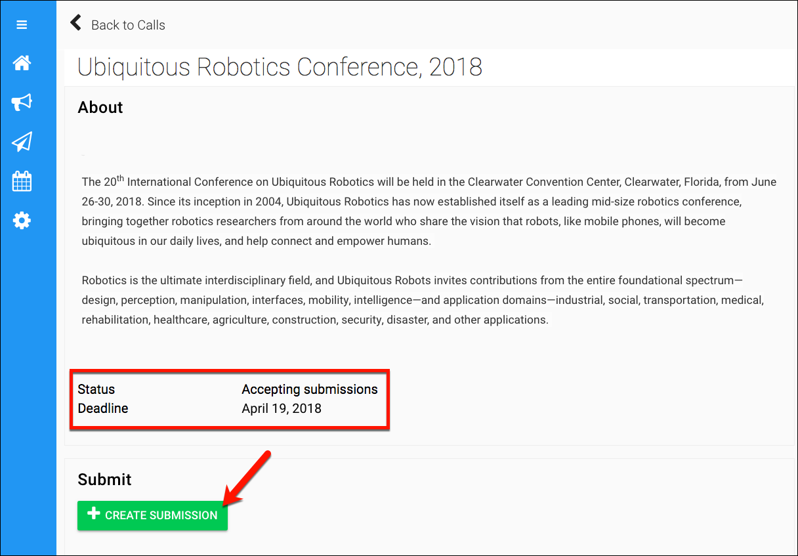

##Preparing the Submission

Begin making entries into the fields on the submission form. Likely, you'll encounter fields for the title, authors, institution/company, and the abstract.

**Required fields:** If you inadvertently skip over any required fields, these will be shown in red highlighting.

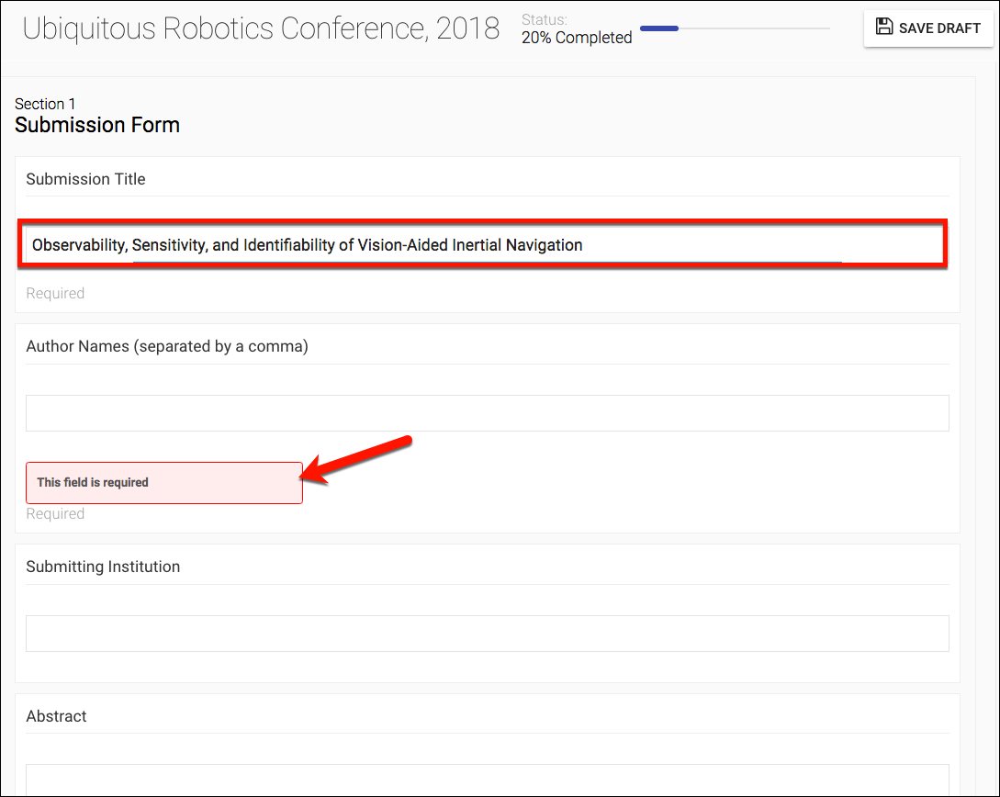

Continue down the form, where you may encounter checkboxes or drop-down lists. Make selections from these options to distinguish and qualify your submission.

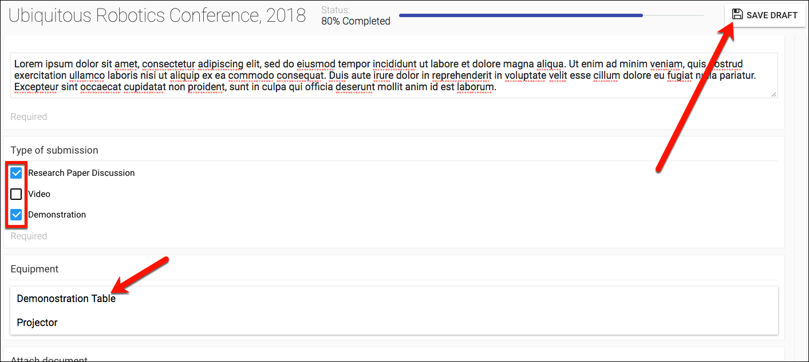

Many submission forms will contain a **Choose Attachment** button. 

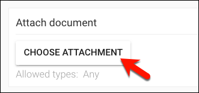

Click this button to display a popup window, into which you can drag the file(s) that corresponds to your submission. Take care to observe if the call has set a limit on the number of files.

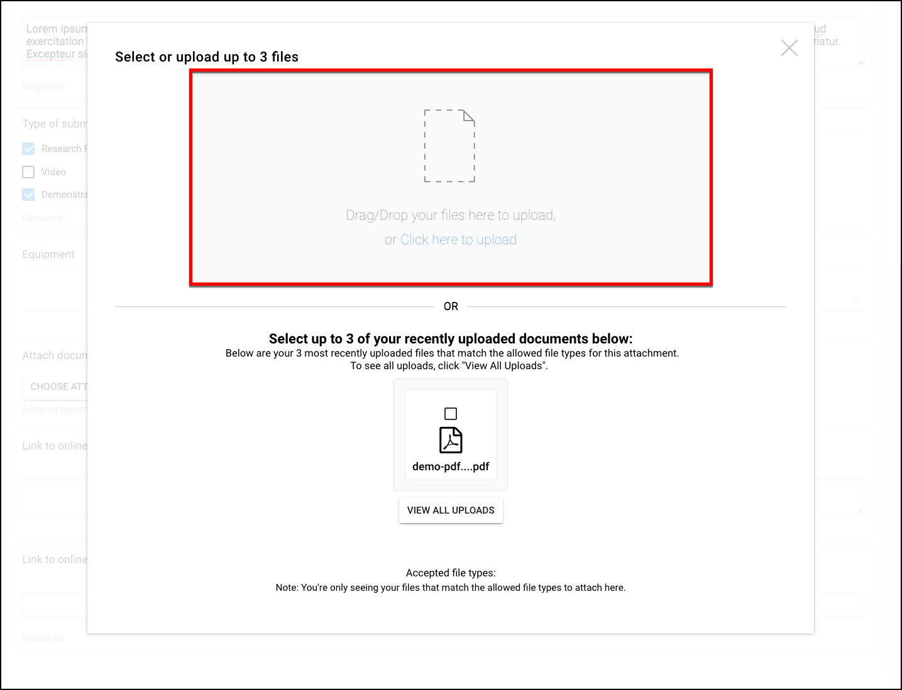

After a moment, you'll see an icon that indicates recognition of your file. Verify that this is the correct file, and then click the **Upload** button.

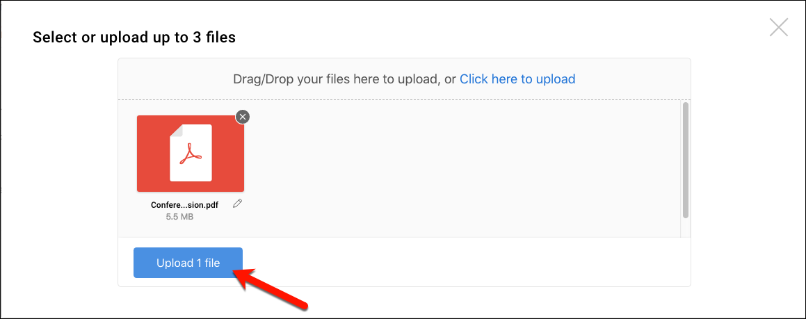

A progress bar will appear to show you the time estimate for completing the upload. When it is complete, the popup window will look similar to the figure below.

**NOTE:** If necessary, click the **Select Different Files** button and repeat the steps above.

If you are done uploading files, click the **Proceed with Uploaded Files** button.

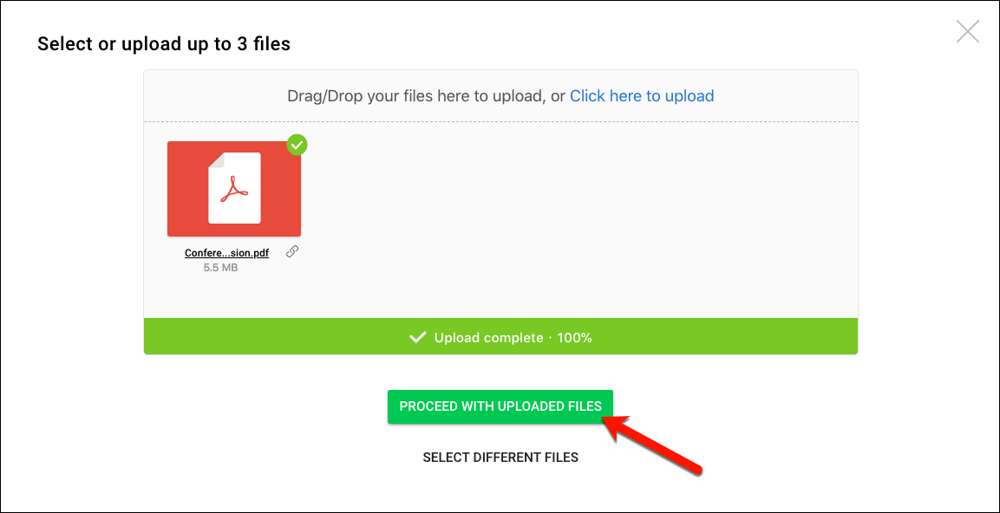

Make entries in all remaining required fields, and then click the **Finish** button.

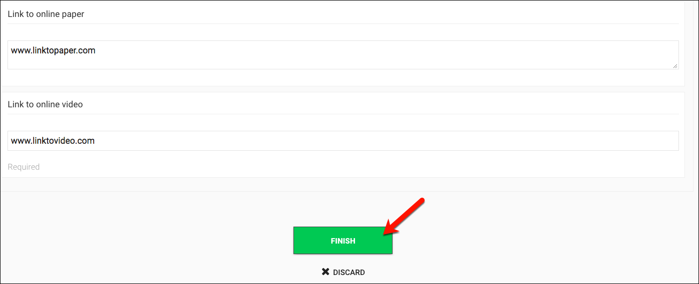

Next, you'll see a prompt to review your submission for spelling and format.

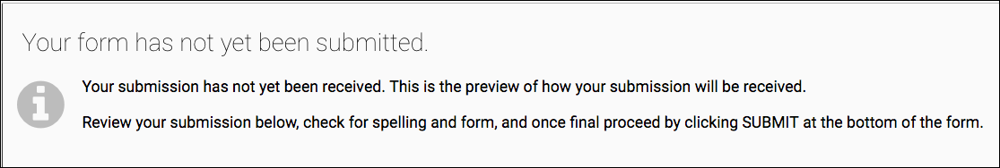

##Sending Your Submission

Scroll to the bottom. If necessary click the **Edit** button. When you are ready, click the **Submit** button.

You should receive a **Success** response. Click the **View Submission** button.

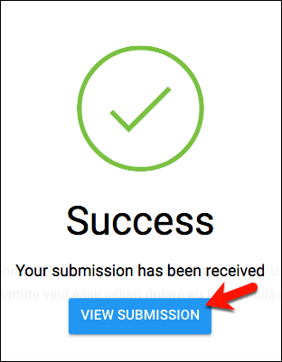

Navigate to the home page and click on the **Calls** button to view your submission.

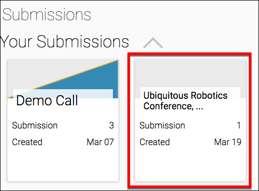

